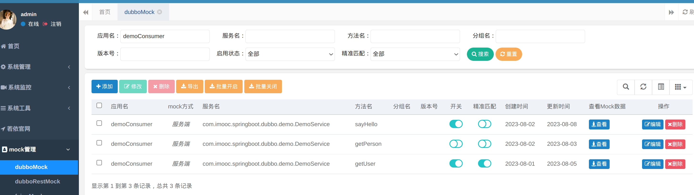
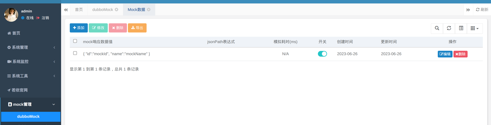
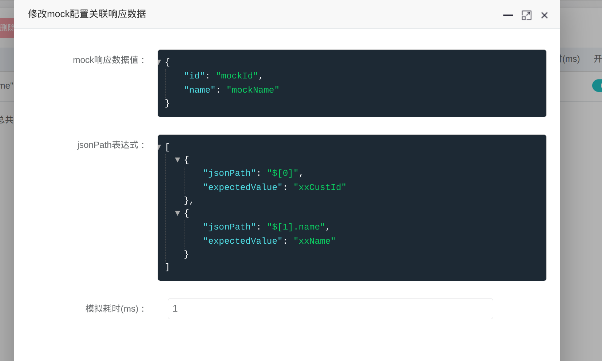

# mock平台

* 零侵入式mock平台，多协议支持（dubbo2.x,3.x,openfeign,http）
* 自动扫描、自动注册
* 支持动态参数匹配
* 支持动态数据(支持函数生成数据)
* 云原生支持
* 支持模拟耗时







## Getting started

The following code snippet comes from [Dubbo Samples](https://github.com/apache/dubbo-samples.git). You may clone the sample project and step into the `dubbo-samples-api` subdirectory before proceeding.

```bash
git clone https://github.com/apache/dubbo-samples.git
cd dubbo-samples/1-basic/dubbo-samples-api
```

There's a [README](https://github.com/apache/dubbo-samples/blob/389cd612f1ea57ee6e575005b32f195c442c35a2/1-basic/dubbo-samples-api/README.md) file under `dubbo-samples-api` directory. We recommend referencing the samples in that directory by following the below-mentioned instructions: 

